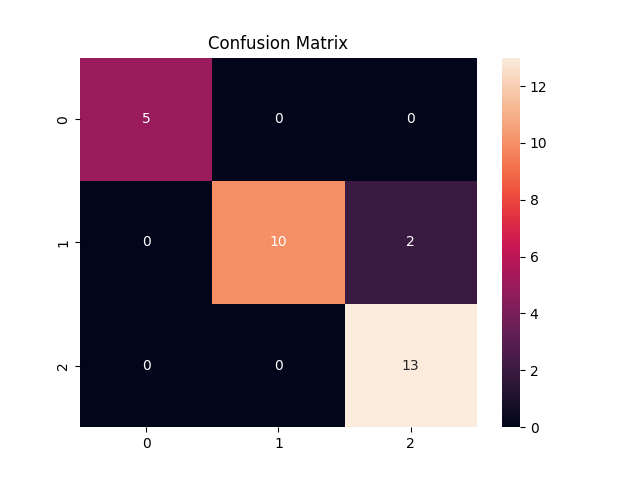

# 🤖 K-Nearest Neighbors (KNN) Classification

## 📌 Project Description
This project demonstrates the implementation of the **K-Nearest Neighbors (KNN)** machine learning algorithm using Python and scikit-learn.  
The model is trained on the Iris dataset to classify different species of flowers based on their features.

This project covers the complete workflow of a machine learning model including data preprocessing, normalization, model training, evaluation, and visualization.

---

## 🎯 Objective
The objective of this project is to:

- Understand how the KNN algorithm works  
- Normalize data before training  
- Train and test a KNN model  
- Evaluate model accuracy  
- Generate a confusion matrix  
- Visualize results  

---

## 🛠 Technologies & Libraries Used
- Python 3  
- NumPy  
- Pandas  
- Matplotlib  
- Seaborn  
- Scikit-learn  

---

## 📂 Project Structure
```
KNN-Classification/
│
├── knn.py
├── screenshot.png
└── README.md
```

---

## ▶️ How to Run the Program

### Step 1: Install required libraries
Open terminal and run:
```bash
pip3 install pandas numpy matplotlib seaborn scikit-learn
```

### Step 2: Run the program
```bash
python3 knn.py
```

---

## 💻 Features
- Loads Iris dataset  
- Splits dataset into training and testing sets  
- Normalizes data using StandardScaler  
- Applies KNN algorithm  
- Calculates accuracy  
- Displays confusion matrix  
- Visualizes results using matplotlib  

---

## 📊 Output
The program prints model accuracy and displays a confusion matrix graph.

### Output Screenshot


---

## 🧠 Machine Learning Concepts Used
- K-Nearest Neighbors (KNN)  
- Feature scaling (Normalization)  
- Train-test split  
- Accuracy evaluation  
- Confusion matrix  

---

## 🎓 Learning Outcome
- How KNN classification works  
- Importance of normalization  
- How to evaluate ML models  
- How to visualize results  
- How to implement ML using scikit-learn  

